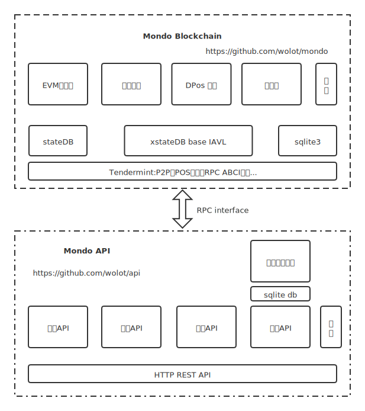

# Mondo
Mondo是基于tendermint框架开发的链，移植以太坊EVM智能合约虚拟机，有自己独立的DPos权益、批量交易、链治理等特性。

## 安装
[mondo v4全新部署与升级.md](https://github.com/wolot/mondo/blob/master/mondo%20v4%E5%85%A8%E6%96%B0%E9%83%A8%E7%BD%B2%E4%B8%8E%E5%8D%87%E7%BA%A7.md)

## 命令行
[mondo 全节点操作手册](https://github.com/wolot/mondo/blob/master/%E5%91%BD%E4%BB%A4%E8%A1%8C.md)

## API
[API文档.md](https://github.com/wolot/api/blob/master/docs.md)

## SDK
- https://github.com/wolot/gosdk
- https://github.com/wolot/javasdk
- https://github.com/wolot/jssdk 开发中