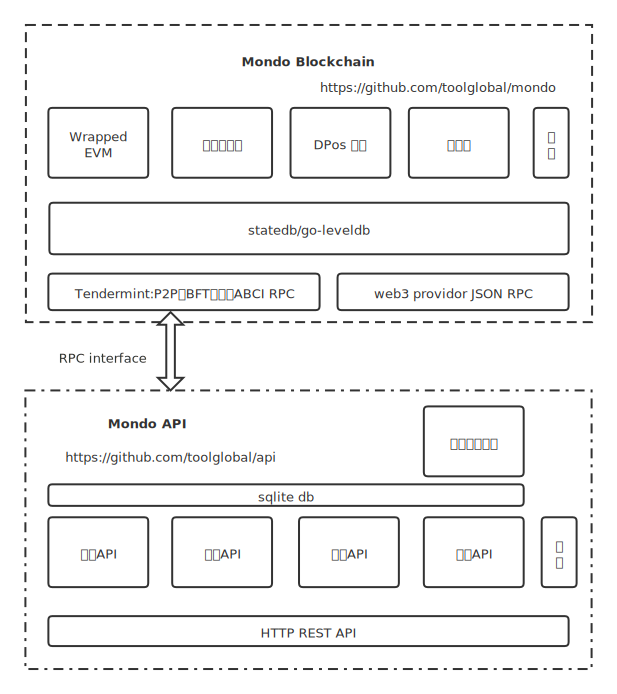

# Mondo

Mondo基于tendermint和ethereum开发，共识机制为PBFT+DPos，有自己独立的DPos权益、批量交易、链治理等特性。

Mondo提供兼容以太坊evm智能合约虚拟机，支持solidity 0.8.*；Mondo提供类以太坊的web3 provider JSON RPC接口，支持以太坊的钱包、DAPP均可无缝使用Mondo网络，JSON RPC不支持ethereum London Fork。

## 架构图

## EVM version
`istanbul`

## 网络
Mondo主网和测试网络信息如下

|  name   |         web3 provider         | chainid | network id |             explorer              |              faucet               |
| ------- | ----------------------------- | ------- | ---------- | --------------------------------- | --------------------------------- |
| mainnet | https://mainnet-web3.wolot.io | 8723    | 8723       | https://www.olo.network           | N/A                               |
| testnet | https://testnet-web3.wolot.io | 8724    | 8724       | https://testnet-explorer.wolot.io | https://testnet-explorer.wolot.io |

## HD Wallet
BIP44 Registered [slip-0044.md](https://github.com/satoshilabs/slips/blob/master/slip-0044.md)

| index |    hexa    | symbol |    coin     |
| ----- | ---------- | ------ | ----------- |
| 479   | 0x800001df | OLO    | Tool Global |

## 文档
- [安装部署](docs/install.md)
- [命令行cmdline](docs/CMDLINE.md)
- [web3 provider JSON RPC](docs/json-rpc.md)

## REST API [不再维护]
- [API文档.md](https://github.com/toolglobal/api/blob/master/docs.md)

## SDK
可以使用ethereum的sdk连接Mondo的web3 provider。

- https://github.com/toolglobal/gosdk
- https://github.com/toolglobal/ethrpc
- https://github.com/toolglobal/javasdk
- https://github.com/toolglobal/jssdk 开发中